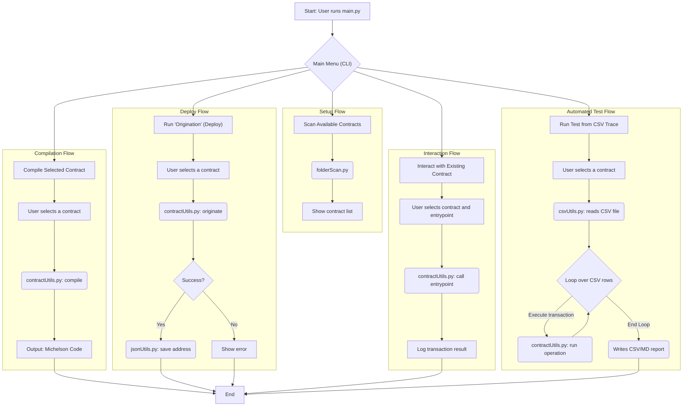

# **Technical Report: A Toolchain for Tezos Smart Contract Management**

## **1. Introduction**

This report describes a toolchain developed in Python to automate and streamline the lifecycle of smart contracts on the Tezos blockchain. The primary goal of this tool is to optimize the processes of compiling, deploying, and interacting with contracts, while also providing features to monitor transaction costs.

The toolchain is built using the `PyTezos` library for communication with the Tezos network (specifically, the "ghostnet") and is designed to manage a variety of smart contracts written in `SmartPy`. The system is intended to be interactive, guiding the user through the various available operations, from managing a single contract to executing tests based on predefined traces.

**Key Technologies and Components:**

  * **Language:** Python 3
  * **Blockchain Library:** PyTezos
  * **Smart Contract Framework:** SmartPy
  * **Supported Operations:** Compilation, Deployment, Interaction, Trace Execution
  * **Output:** Transaction cost reports in CSV and JSON formats

-----

## **2. Toolchain Architecture**

The toolchain consists of a main module that orchestrates several specialized utilities, each responsible for a specific phase of the workflow.

  * **Core Components:**

      * `main.py`: This is the heart of the toolchain. It manages the interactive menu, collects user input, and invokes the appropriate functions to perform the requested operation (e.g., compile, deploy).
      * `contractUtils.py`: This module provides the logical functions for interacting with the blockchain. It contains the logic to compile `SmartPy` files, originate (deploy) new contracts on the network, and call their entrypoints. It is also responsible for analyzing the results of operations to extract detailed cost information (gas, storage fees).
      * `folderScan.py`: A simple utility that scans the `../contracts/` directory to identify all available smart contract projects that the toolchain can interact with.
      * `csvUtils.py` & `jsonUtils.py`: These modules handle data persistence. `csvUtils` is used to read execution traces (CSV files defining a sequence of contract calls) and to write transaction reports. `jsonUtils` is responsible for updating the list of deployed contract addresses and saving reports in JSON format.

  * **Directory Structure:**

      * `toolchain/`: Contains all Python scripts for the toolchain.
      * `toolchain/execution_traces/`: Stores the CSV files with execution traces for automated contract testing.
      * `contracts/`: Contains subfolders for each smart contract, with each folder holding its SmartPy source code (`.py`) and, in some cases, a descriptive `README.md` file.

-----

## **3. Workflow**

The user starts the toolchain by running `python3 main.py` from the command line. From there, the operational flow is divided into four main scenarios:

1.  **Compilation:**

      * The user selects the "Compile" option.
      * A list of available contracts, obtained via `folderScan`, is presented.
      * After a selection is made, the toolchain invokes a process to run the chosen contract's SmartPy script, which compiles it into Michelson and generates the storage and code files ready for deployment.

2.  **Deployment (Origination):**

      * The user selects the "Deploy" option and chooses a previously compiled contract.
      * They provide an initial balance for the new contract.
      * The `origination` function in `contractUtils.py` reads the Michelson files, creates an origination operation, and injects it into the blockchain via `PyTezos`.
      * Once the operation is confirmed, the new contract's address is saved to the `addressList.json` file using `jsonUtils.addressUpdate` for future use.

3.  **Interaction:**

      * The user selects "Interact" and chooses a deployed contract.
      * The toolchain analyzes the contract's entrypoints and prompts the user for which one to call, what parameters to provide, and the amount of tez to send, if any.
      * `contractUtils.entrypointCall` builds and sends the transaction.
      * Upon completion, the user is asked if they want to export the operation's details and costs to CSV and JSON files.

4.  **Trace Execution (Automated Testing):**

      * This is the most advanced feature. The user selects "Use Execution Trace".
      * The `csvUtils.csvReader` module reads files from the `execution_traces/` directory. Each CSV file contains a series of steps, where each row specifies the `entrypoint`, `wallet`, `parameters`, and `tezAmount`.
      * The `executionSetup` function iterates through these rows, simulating a sequence of real transactions and recording the results for each step. This allows for testing complex scenarios and measuring their costs in a reproducible manner.



-----

## **4. Configuration and Usage**

  * **Prerequisites:**

      * Python 3 installed.
      * Required Python libraries, primarily `pytezos` and its dependencies.
      * A `wallet.json` file in the `toolchain/` directory containing the private keys of the Tezos accounts to be used for operations.

  * **Execution:**
    To start the toolchain, the user must navigate to the `toolchain/` directory and run the command:

    ```bash
    python3 main.py
    ```

    The main menu will then be displayed, guiding the user through the subsequent choices.


## Tezos Blockchain Fee Model

### Section 1: Tezos Economic Model

Fees on Tezos, paid in XTZ, serve two critical and interconnected functions. Firstly, they represent the economic incentive for the network's validators, known as "bakers." Bakers are responsible for creating, signing, and publishing new blocks, as well as validating the transactions within them. The fees collected from transactions included in a block form part of their reward, compensating them for the computational resources used and for their role in maintaining the security and integrity of the network.

Secondly, fees act as a defense mechanism against malicious or wasteful activities. By imposing a cost on every operation, the system discourages spam and Sybil attacks, in which an attacker might attempt to flood the network with useless transactions to degrade its performance or bloat its state. The cost associated with creating new accounts and using storage is specifically designed to mitigate these risks.

#### Overview of Key Concepts

To fully understand the Tezos fee model, it is essential to define some fundamental concepts:

* **Gas**: An abstract unit of measurement that quantifies the computational cost required to execute an operation on the blockchain, particularly for executing instructions within a smart contract. Its primary purpose is to limit the amount of computation a single transaction can require, thus preventing infinite loops or excessive resource usage that could stall the network.
* **Storage Cost**: A specific cost associated with increasing the permanent storage space on the blockchain. Whenever an operation writes new data to the chain's state (e.g., creating a new account or updating a contract's storage), a cost proportional to the size of the added data, measured in bytes, is charged.
* **Baker Fees**: The explicit fees paid by users and collected by bakers as compensation for including a transaction in a block. These fees are calculated based on the gas consumed and the size of the transaction.
* **Burning**: A mechanism through which a specific part of the costs, namely the *storage cost*, is permanently removed from circulation ("burned") instead of being allocated to a baker.

### Section 2: Transaction Fee Formula

#### The Fundamental Formula

The Tezos fee model is known for its predictability, based on a deterministic formula that calculates the minimum cost of a transaction. This formula, as documented by sources like [OpenTezos](https://opentezos.com/tezos-basics/economics-and-rewards/), establishes the threshold below which a baker will not accept a transaction. The formula is as follows:

$$\text{Fees} \geq \text{min}_F + (\text{min}(\text{nꜩ/B}) \times s) + (\text{min}(\text{nꜩ/g}_u) \times g)$$

Each component of this formula has a specific role:
* $min\_F$: This is a minimum base fee, set at 100 micro-tez (µꜩ), which covers the fixed costs associated with handling any transaction, regardless of its complexity.
* $s$: Represents the size of the complete operation after being serialized, measured in bytes ($B$).
* $min(nꜩ/B)$: This is the minimum cost per byte of operation data, set at 250 micro-tez per byte (µꜩ/B). This cost is multiplied by the size $s$.
* $g$: Indicates the total gas units ($gu$) consumed by the operation for its computational execution.
* $min(nꜩ/g\_u)$: This is the cost per gas unit, set at 100 nano-tez per gas unit (nꜩ/gu).

It is crucial to emphasize that these values represent the *minimum* costs. Users have the option to offer higher fees to incentivize faster inclusion.

#### Detailed Analysis of Components

**Gas (g)**: Gas is the metric for computational complexity. Every instruction in Tezos' low-level language, Michelson, has a protocol-defined gas cost. The system imposes limits to ensure network stability: a single operation cannot consume more than 1,040,000 gas units, and an entire block has an aggregate gas limit (this limit has been progressively increased with protocol upgrades). These limits determine the number and maximum complexity of transactions that can be included in a single block.

**Storage and Storage Cost**: In addition to the fees calculated by the formula, a separate cost applies whenever an operation increases the amount of data permanently stored on the blockchain. This cost was drastically reduced with the "Delphi" protocol upgrade, dropping from 1 XTZ per kilobyte to 0.25 XTZ per kilobyte (equivalent to 250 µꜩ per byte). This storage cost is the most significant factor in deploying smart contracts.

| Parameter | Description | Value (Post-Delphi) |
| :--- | :--- | :--- |
| $min\_F$ | Minimum base fee | 100 µꜩ |
| $min(nꜩ/B)$ | Minimum cost per byte of operation | 250 µꜩ/B |
| $min(nꜩ/g\_u)$ | Minimum cost per gas unit | 100 nꜩ/gu |
| Storage Cost | Cost for increasing storage (burned) | 0.25 ꜩ/kB (250 µꜩ/B) |
| Gas Limit/Operation | Maximum gas consumable by a single operation | 1,040,000 gu |
| Gas Limit/Block | Maximum gas consumable by an entire block | Variable with upgrades (e.g., >10,400,000 gu post-Carthage) |

### Section 3: Cost Analysis for Simple Transactions

#### Calculation for a Standard XTZ Transfer

For a standard transaction, such as transferring XTZ between two existing `tz1` accounts, the costs are extremely low. In this scenario, the operation does not increase the blockchain's storage, and gas consumption is minimal, as the execution is computationally simple. Consequently, the total fees are typically very low, often equivalent to a fraction of a US dollar cent. This makes Tezos a very efficient platform for simple peer-to-peer payments.

#### The "Reveal" Operation and the Cost of the First Transaction

A key aspect is the cost of the first outgoing transaction from a new account; this initial operation must include an additional operation called a "reveal." The purpose of the reveal is to register the account's public key on the blockchain, making it available for verifying the signatures of future transactions. This reveal operation incurs an additional fee, estimated at about 0.00142 XTZ. This cost is added to that of the main transaction (e.g., a transfer), explaining why the first transaction from a newly created wallet is slightly more expensive than subsequent ones. Once the public key has been revealed, the operation does not need to be repeated for the same account.

#### Account/Wallet Creation Costs

Creating a new account on the Tezos blockchain involves specific costs. These costs are designed to prevent spam and network abuse. A detailed analysis shows that creating a new wallet can cost approximately 1.33964 XTZ, a figure that breaks down into several parts:
* **Baker fees**: 0.04764 XTZ, which remunerates the baker.
* **Storage fees**: 1.035 XTZ, which are burned to pay for the permanent storage space required for the new account.
* **Allocation fees**: 0.257 XTZ, an allocation cost that is also burned to reserve the address on the chain.

### Section 4: Cost Analysis for Smart Contracts

#### 4.1. Creation (Origination) Costs

The process of deploying a smart contract on the Tezos blockchain is called "origination." This operation creates a new type of account, identified by an address starting with `KT1`, which contains the contract's executable code (written in Michelson) and its dedicated storage space.

The costs associated with originating a contract are primarily determined by two factors:
1.  **Size of the Contract's Code**: The contract's Michelson code is stored permanently on the blockchain. There is a technical limit on the maximum size of an operation, which effectively limits a contract's code size to about 16 KB. The code size contributes to the fee component related to bytes ($min(nꜩ/B) \times s$).
2.  **Size of the Initial Storage**: This is often the most significant cost factor during origination. The space required to store the contract's initial state is paid at a rate of 0.25 XTZ per kilobyte.

#### 4.2. Usage (Interaction) Costs

Once a contract has been originated, every interaction with it (i.e., every call to one of its functions, or "entrypoints") incurs costs.

* **Entrypoint Complexity and Gas Consumption**: The main factor determining the cost of an interaction is gas consumption. This depends directly on the complexity and number of Michelson instructions that must be executed. Functions that perform complex mathematical calculations, iterate over large data collections, or make calls to other smart contracts will consume a larger amount of gas and, consequently, have a higher fee.
* **Impact of Storage Modifications**: If a call to an entrypoint modifies the contract's state by increasing its size (for example, by adding a new element to a map or a list in the storage), the user will be charged an additional storage cost. This cost is calculated based on the added bytes (0.25 XTZ/kB) and, as with origination, is entirely burned. This means that operations that "write" to the blockchain are inherently more expensive than those that merely "read" or compute.

The Tezos smart contract cost model creates a strong incentive for code and storage optimization, promoting a "gas-aware" development paradigm from the earliest design stages.


# License

This project is licensed under the Creative Commons Attribution 4.0 International License. To view a copy of this license, visit [creativecommons.org](http://creativecommons.org/licenses/by/4.0/) or see the `LICENSE` file.